# Bamazon

## Overview

This is an Amazon-like storefront. This app will take in orders from customers and deplete stock from the store's inventory. The app also track product sales across the store's departments and then provide a summary of the highest-grossing departments in the store.

- - -

# Views

## Customer View

**1.)** Customer is prompt to select which item they would like to buy. Select item by moving up and down with arrow key.
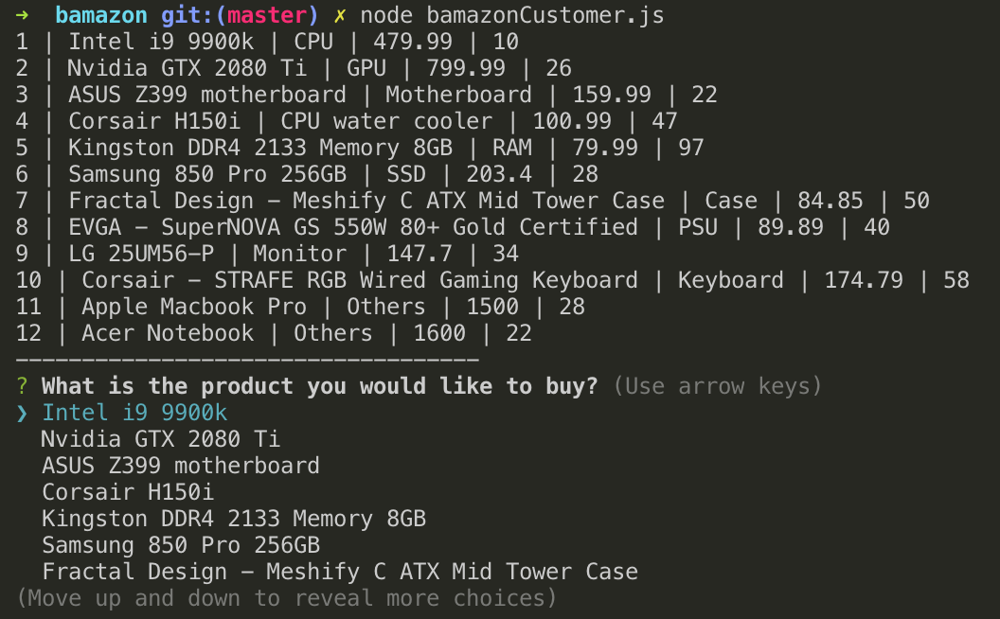

**2.)** Once the customer have selected the item, they are then prompt to enter the number of units they want to buy.
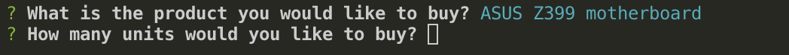

**3.)** Once the customer finished purchasing, a purchase summery will be printed. 
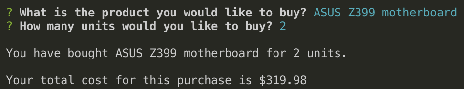

**NOTE** If customer tries to purchase more than the inventory, a warning will be displayed.
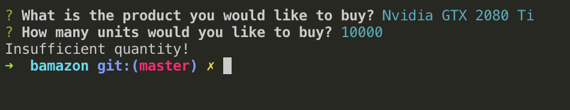

- - -

## Manager View

* When run, it will prompt a list of actions for manager to choose from. 
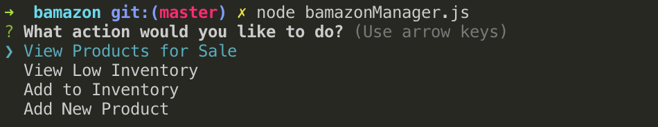

### Four functions

**1.)** View Products for Sale

* A table is created with product names shown along with prices and quantity available.
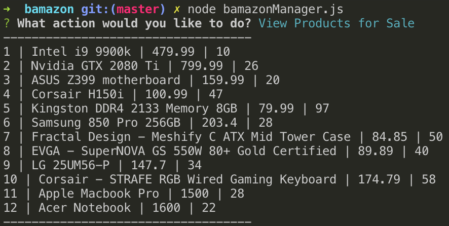

**2.)** View Low Inventory

* A table is created to display information on products with less than 5 units in the inventory
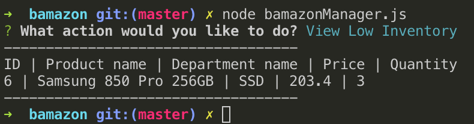

**3.)** Add to Inventory

* User is prompted to select which product they want to add inventory to and the units. 
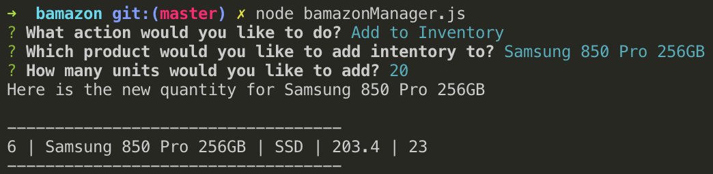

**4.)** Add New Product
* User is prompted to answer a series of question about the new product

    * Product Name (string)
    * Product id (integer)
    * Name of the department the product belongs to (choice)
    * The price of the product (Decimals)
    * The quantity of the product we have in our inventory (Integer)

* A table is then displayed with all the products info
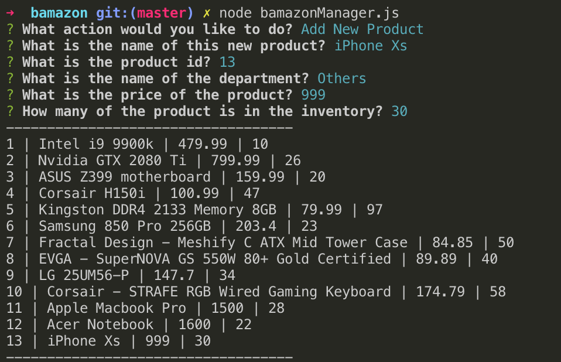

- - -

## Supervisor View

* User can choose from two options: View Product Sales by Department or Create New Department

### Option 1: View Product Sales by Department

* A table is displayed by department with product sales and total profit per department. 
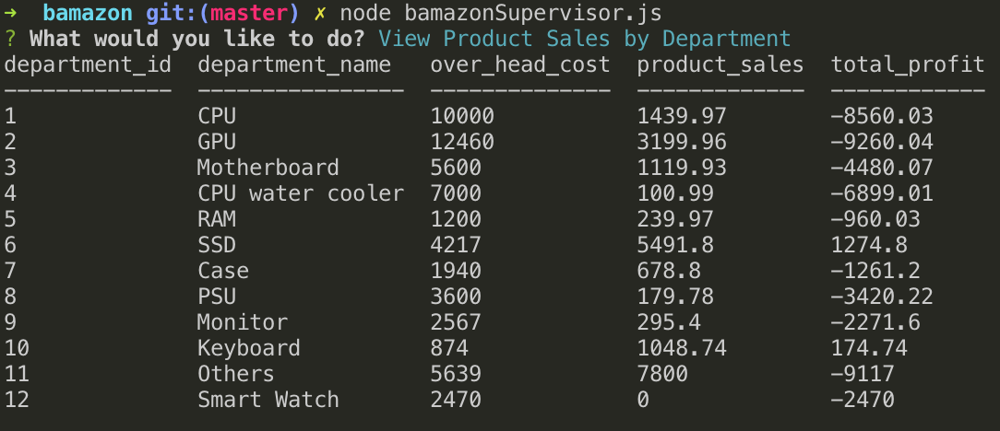

### Option 2: Create New Department

* A series of question is asked when creating a new department and a message is displayed after creating the new department

    * Department name (tring)
    * Overhead cost (Decimal)

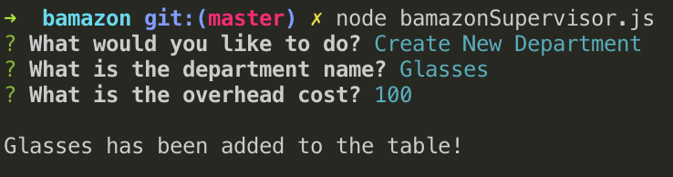